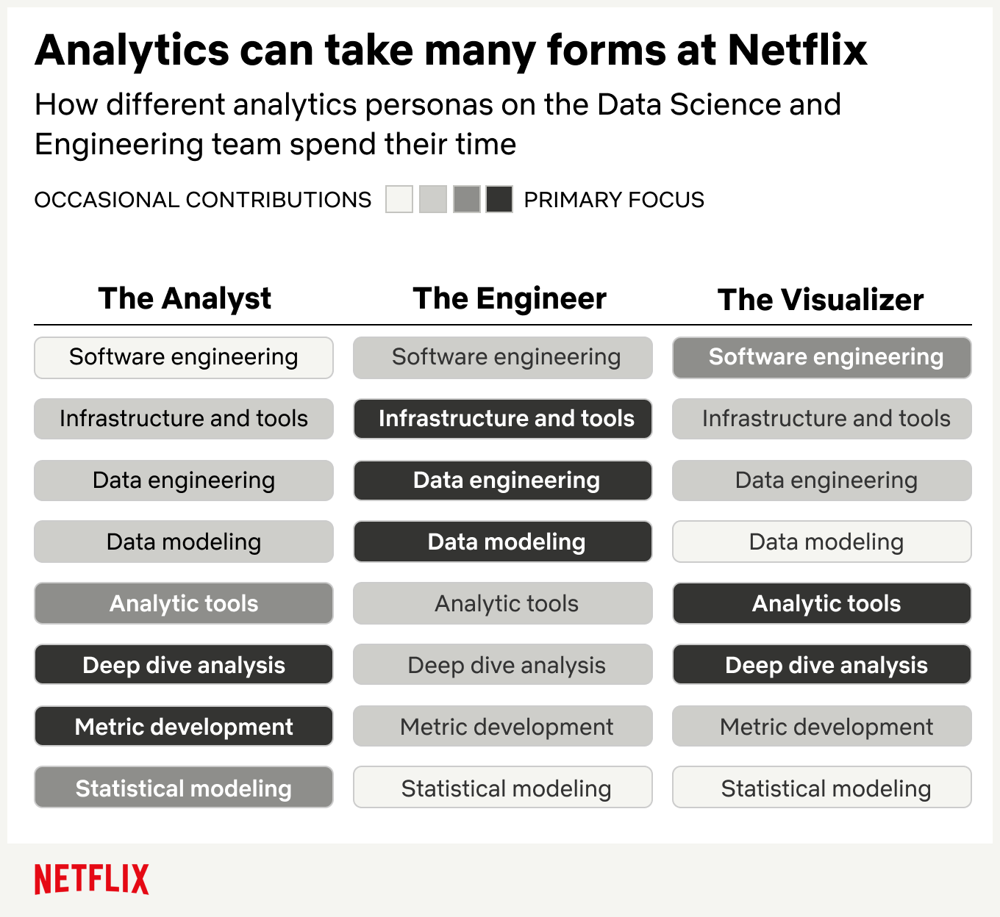

# Notas para un mejor CV en Ciencia de Datos
**Fecha:** 04/Marzo/2021

**Autor:** César Zamora

# 0. Intro

Estas breves notas tienen por objetivo de ayudar a posicionarnos como mejores candidatos a puestos en los que se inicia profesionalmente hacia ciencia de datos, basados en mi propia experiencia. 

# 1. Ciencia de datos en el mercado

> “(...) a data scientist is **someone who knows how to extract meaning from and interpret data**, which requires both **tools and methods from statistics and machine learning,** as well as being human. She spends a lot of time in the process of collecting, cleaning, and munging data, because data is never clean. This process requires persistence, **statistics, and software engineering skills**—skills that are also necessary for understanding biases in the data, and for debugging logging output from code.
>
> Once she gets the data into shape, a crucial part is exploratory data analysis, which combines visualization and data sense. She’ll find patterns, build models, and algorithms—some with the intention of understanding product usage and the overall health of the product, and others to serve as prototypes that ultimately get baked back into the product. She may design experiments, and she is a critical part of data-driven decision making. She’ll **communicate with team members, engineers, and leadership in clear language** and with data visualizations so that even if her colleagues are not immersed in the data themselves, they will understand the implications.”

Source: O’Neil, C., and Schutt, R. *Doing Data Science.* First edition.

En el mercado laboral actual, se espera que un Data Scientist sea un experto capaz de ayudar a resolver problemas clave para un negocio, con herramientas técnicas y generando insights que sea accionables rápidamente. Por lo tanto se necesita una mezcla de diferentes habilidades de liderazgo, comunicación, trabajo en equipo y expertise técnico:

* **Definición del alcance del problema y del proyecto**, porque deberá poder pasar de una descripción vaga y difusa del proyecto a un problema que pueda resolver, comprender los objetivos del proyecto, las intervenciones que está informando, los datos que tiene y necesita, y el análisis que se necesita hacer.

* **Gestión de proyectos**, para progresar en equipo, para trabajar eficazmente con su socio de proyecto y trabajar con un equipo para que esa solución útil realmente suceda.

* **Comunicaciones**, porque necesitará poder contar la historia de por qué lo que está haciendo es importante y los métodos que está utilizando a una amplia audiencia, que no necesariamente es experta ni el data scientist será experto en el área de dominio de su público.

* **Programación**, porque necesitará decirle a su computadora qué hacer, generalmente escribiendo código.

* **Ciencias de la computación**, porque necesitará comprender cómo están (y deben estar) estructurados sus datos, así como los algoritmos que utiliza para analizarlos.

* **Matemáticas y estadísticas**, porque todo lo demás en la vida son solo matemáticas aplicadas, y los resultados numéricos no tienen sentido sin alguna medida de incertidumbre.

* **Aprendizaje automático**, porque querrá crear modelos predictivos o descriptivos que puedan aprender, evolucionar y mejorar con el tiempo.

  

## 1.1 ¿Qué roles existen?

Aunque la denominación de los roles y las funciones asociadas los productos de datos varían de empresa a empresa, podemos apreciar el caso de Netflix a través de las publicaciones en su blog:

 https://netflixtechblog.com/analytics-at-netflix-who-we-are-and-what-we-do-7d9c08fe6965

# 2. Sobre los procesos de reclutamiento 

Los procesos de reclutamiento en el área de ciencia de datos son muy similares a los de cualquier área tecnológica:

* Primer contacto con personal de la empresa: fisico o virtual,
* **Envío de CV del candidato**
* **Selección de los candidatos relevantes para entrevistas** considerando:
  * Personal de recursos humanos, para posteriormente
  * Manager directo y/o personal con fuertes conocimientos técnicos a los que reporta la posición.
* Puede o no incluir:
  * Exámenes de conocimiento,
  * Soluciones de un caso de negocio, que incluyen partes técnicas.

* Propuesta laboral
* Contratación

**Nota:** 

* Las entrevistas telefónicas y por medios digitales (Teams, Zoom, Google Hang Out) son muy usadas debido a la pandemia.
* Los primeros contactos suelen ser con personas que no poseen background en ciencia de datos, por lo que es indispensable que el CV cuente con términos claros y concretos que perfilen a un candidato como idoneo para una posición de ciencia de datos. Ver detalle más adelante.

# 2. Sobre el CV

## 2.1 Consideraciones generales

* Es un **medio rápido** para que los empleadores conozcan a los posibles candidatos
* Por el nivel de exigencia en sus puestos, el personal de RH, los mánagers y expertos técnicos dedican poco tiempo a la revisión de los CV de los candidatos.
* Es indispensable que el CV cuente con:
  * Términos clave relacionados con ciencia de datos
  * Proyectos o experiencia que se pueda ligar a la vacantes
  * Mención a herramientas tecnológicas que se espera el candidato domine en la posición.
* El formato debe ser 1) formal,  2) suficientemente claro y 3) organizado para abstraer la información relevante del candidato *en relación con el puesto*.
  * Extracción a partir de perfil de Linkedin

## 2.2 Términos clave

### A. **Coursework**

Los cursos clave son un buen elemento a destacar, ya que dan visiblidad de los conocimientos que el candidato posee. Ejemplo:

*Cursos clave*

* Econometría,
* Procesamiento de Lenguaje Natural
* Inferencia Bayesiana
* Machine Learning 
* Optimización

### B. **Lenguajes de programación**

* Python
  * Librerias específicas para ciencia de datos (Pandas, Numpy, Scipy, Scikit-learn etc)
* R
  * Conceptos clave
  * Librerias específicas para ciencia de datos (Tydiverse, xts, broom, Rstan etc)
* SQL
  * Existen muchos motores comercialmente usados (PostgreSQL, MySQL, Oracle, etc)

Plasmar al menos uno de entre Python o R!

### C.**Herramientas tecnológicas**

* Jupyter Notebooks, Anaconda, Ambientes virtuales

* GNU/Linux (porque es lo que se usa en cómputo en la nube)
  * Conocimiento de alguna distribución, como Ubuntu
  * Uso de la terminal

* Plataformas de cómputo en la nube: Amazon Web Services (más usado), Azure (Microsoft) o Google Cloud (Google).

### D. **Desarrollo de software**

* Git
* Cuenta de Github o Gitlab, crearla en caso de no tener.
* Github Flow

### E. Herramientas de visualización comunmente usadas

**Interactivos:**

* Software de paga: Power BI y Tableau, mayormente porque son sencillos de usar, compatibles con suits ofimáticas, se pueden conectar con archivos localeles, bases de datos o la nube y brindan una experiencia business. 
* Open source: Shinny (R), Plottly (R y Python)

**Estáticos:**

* Python: Seaborn, Matplolib
* R: ggplot

### F. **Portafolio de proyectos**

* Proyectos relacionados con ciencia de datos son indispensables para destacar de otros candidatos:
  * académicos, estancias, servicio social, volutariado, tesis o 
  * competencias (Kaggle/Hackatones)

* Es muy bien visto que el CV incluya la consulta del material en línea (código, entregables, impacto de proyecto)
* Proyectos colaborativos son bien recibidos, porque demuestran el trabajo en equipo.
  * Es recomendable que los proyectos sean muy concretos que resuelvan, por ejemplo:
    * **Problemas de predicción supervisada**:
      * Regresión (e.g Random Forest, Xgboost, series de tiempo, etc)
      * Clasificación (regresión logística).
    * **Problemasno supervisados:**
      * Clustering
    * **Visualizaciones**

# 3. Perfil de Linkedin

[WIP: Desarrollo]

* Linkedin permite generar un CV con un formato claro y conciso.

# 4. Estrategias para búsqueda de trabajo

* Networking (por ejemplo a través de LinkedIn, acercamientos directos con personas; enviar mensajes en temas comunes o preguntas suele tener buenas respuestas en redes sociales)
  * Las redes de conocidos en LinkedIn es un gran espacio para promocionar:
    * Los proyectos o cursos que se estan haciendo,
    * Los temas de interés común con otros profesionales,
    * Conocer que están haciendo otras empresas y personas, para explotarlo como oportunidades de entrada.
* Seguimiento de redes sociales de empresas
* Identificación de programas para nuevos talentos, idealmente buscan captar talento y desarrollarlo para una carrera dentro de la empresa:
  * Ejemplos:
    * [New Tiggers de Kellogg's Company](https://www.kelloggs.com.mx/es_MX/content/articulos/responsabilidad-corporativa/new-tigers-la-generacion-de-profesionales-con-crecimiento-acelerado-y-mucha-garra.html)
    * [Semillero de Talentos del Instituto Federal de Telecomunicaciones](http://www.ift.org.mx/sites/default/files/contenidogeneral/conocenos/convocatoriaespecialparasemillerodetalentovfunam.pdf), ver también la página de la bolsa del trabajo https://protalentoift.ift.org.mx/pbtConcursoLista.asp
* Sitios relevantes para la busqueda de empleo:
  * OCC: https://www.occ.com.mx/,
  * Búmeran: https://www.bumeran.com.mx,
  * Indeed: https://mx.indeed.com
  * CompuTrabajo: https://www.computrabajo.com.mx
  * Bolsa de trabajo UNAM: https://www.dgoserver.unam.mx/portaldgose/bolsa-trabajo/htmls/index.html

# 5. Preparación para entrevistas de trabajo

[WIP: Desarrollo]

**¿Qué puede sumar a un candidato?**

* Investigar los proyectos que la empresa ha realizado y las metas que tiene a futuro.
* Hacer preguntas que demuestren 

# 6. Referencias

**Libros sobre ciencia de datos**

- - [Doing Data Science](https://www.safaribooksonline.com/library/view/doing-data-science/9781449363871/)
  - [The Art of Data Science](https://leanpub.com/artofdatascience)
  
- Programación en R

- - [Exploratory Data Analysis with R ](https://leanpub.com/exdata)
  - [Report Writing for Data Science in R ](https://leanpub.com/reportwriting)
- [R for Data Science](http://r4ds.had.co.nz/)
  
- Programación en Python

- - [Data Wrangling with Python ](https://www.safaribooksonline.com/library/view/data-wrangling-with/9781491948804/)
  - [Python: Real-World Data Science](https://www.safaribooksonline.com/library/view/python-real-world-data/9781786465160/)

**Cursos para complementar nuestro CV**

* **Uso de terminal en GNU/Linux:** https://www.netacad.com/es/courses/os-it/ndg-linux-essentials
* **Píldoras informáticas:** en un sitio de programación con muchos cursos gratuitos
  * Git & Github: https://www.pildorasinformaticas.es/course/curso-de-git-github/

* **Mode Analytics**
  * **The SQL for Data Analysis:** https://mode.com/sql-tutorial/introduction-to-sql/
  * **Python** https://mode.com/python-tutorial/

**Repositorio de herramientas de DSSG para Data Science (recomendado)**

* https://github.com/dssg/hitchhikers-guide

**Sitios de competencias en ciencia de datos**

* Kaggle: https://www.kaggle.com

**Cool Articles**

* **Analytics at Netflix: Who Are and What We Do:** https://netflixtechblog.com/analytics-at-netflix-who-we-are-and-what-we-do-7d9c08fe6965

